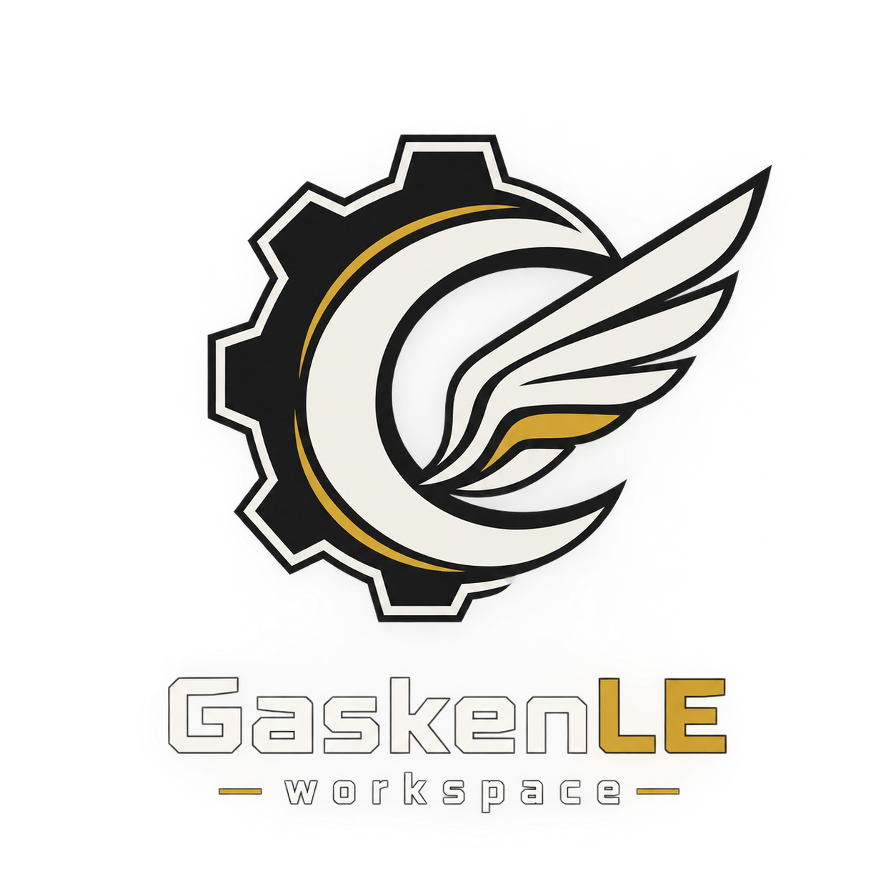

<div align="center">
  
  <h1>GaskenLE</h1>
  <p><strong>— workspace —</strong></p>
  <p><em>Lingkungan kerja terminal otomatis berbasis Ubuntu + GNOME + tmux dengan konsumsi RAM ultra-rendah (~35–50 MB) dan akses berkas berkecepatan 0 ms.</em></p>
</div>

---

## ⚡ Fitur Utama

- **Hemat Memori Ekstrem:** Memangkas konsumsi RAM dari standar IDE berat (~1–2 GB) menjadi baseline hanya **35–50 MB**.
- **Orkestrasi Sekali Perintah:** Cukup jalankan perintah `gasken` dari direktori proyek mana pun, layout 3 panel otomatis dibuat presisi sesuai ukuran jendela terminal.
- **Akses Berkas 0 ms:** Menggunakan placeholder native `%s` di Yazi untuk membuka berkas teks di Nano dan gambar di EOG tanpa delay proses desktop.
- **Navigasi Bebas Hambatan:** Pindah antar-panel instan dengan `Ctrl + Spasi`, `Shift + Tab`, atau `F2` tanpa prefix tmux.
- **Integrasi Event Kernel (inotify):** Setiap berkas yang dibuat/diubah oleh AI Agent langsung terdeteksi otomatis oleh file manager Yazi.

---

## 🖥️ Layout Terminal 3 Panel

```text
+-----------------------------------------------------------------------+
| Sesi Tmux: gasken-[nama-proyek]                                       |
|                                                                       |
| +-----------------------------+-------------------------------------+ |
| | Panel Kiri (40% Lebar)      | Panel Kanan Atas (60% Lebar)        | |
| |                             |                                     | |
| | [AI AGENT PANE]             | [FILE MANAGER: YAZI]                | |
| | Wadah interaksi AI / Hermes | Navigasi direktori & inotify        | |
| |                             | Alt + o: Buka Nano / EOG            | |
| |                             +-------------------------------------+ |
| |                             | Panel Kanan Bawah (35% Tinggi)      | |
| |                             |                                     | |
| |                             | [GIT RUNNER & EXECUTION PANE]       | |
| |                             | git status, test runner, build      | |
| |                             | Ketik 'tutup' untuk keluar total    | |
| +-----------------------------+-------------------------------------+ |
+-----------------------------------------------------------------------+
```

---

## 🚀 Quick Start

### 1. Prasyarat & Izin Eksekusi
Pastikan skrip utama executable:
```bash
chmod +x /home/hikaruu/gasken_workspace/*.sh
```

### 2. Registrasi Perintah Global
Tambahkan alias ke `~/.bashrc`:
```bash
echo 'alias gasken="/home/hikaruu/gasken_workspace/gasken.sh"' >> ~/.bashrc
source ~/.bashrc
```

### 3. Menjalankan Workspace
```bash
cd ~/path/ke/proyek-anda
gasken
```

Untuk menutup seluruh sesi sekaligus: ketik `tutup` atau `bubar` di panel kanan bawah.

---

## 📖 Dokumentasi Lengkap (Docsify)

Dokumentasi modular lengkap tersedia di direktori `docs/`.

### Menjalankan Server Dokumentasi Lokal:
```bash
cd docs

# Opsi 1: Menggunakan Bun (Direkomendasikan - Sangat Cepat)
bun dev

# Opsi 2: Menggunakan Python 3
bun run serve:py
```
Akses di browser: **`http://localhost:3999`**

### Daftar Topik Dokumentasi:
* [Pengenalan & Arsitektur](docs/README.md) — Filosofi, benchmark perbandingan performa, dan rasio panel.
* [Instalasi & Prasyarat](docs/instalasi.md) — Pemasangan dependensi (`tmux`, `yazi`, `nano`, `eog`).
* [Penggunaan Harian](docs/penggunaan.md) — Alur kerja kolaborasi 3 panel & manajemen sesi.
* [Daftar Pintasan (Shortcuts)](docs/shortcut.md) — Tabel lengkap pintasan Tmux, Yazi, dan Nano.
* [Detail File Konfigurasi](docs/konfigurasi.md) — Penjelasan mendalam file skrip dan alasan teknis latensi 0 ms.
* [Koneksi AI & Protokol](docs/koneksi-ai.md) — Panduan integrasi AI Agent dan aturan keamanan sistem.

---

<div align="center">
  <p>Made by <a href="https://github.com/dayattt111" target="_blank">Hikaruu (github.com/dayattt111)</a></p>
</div>
